# dadafinger-skills

> 이 파일은 자동 생성됩니다 — 직접 편집하지 마세요. `python3 scripts/build_visual.py` 로 갱신.
> 카탈로그: [INDEX.md](INDEX.md)
> Scope: `[G:General]` 공유 가능 · `[I:Internal]` 사내 특수(일반화됨) · `[S:Sensitive]` export 제외

> 공유용 export · Sensitive 제외

**총 20개 스킬** · 3개 그룹 · 갱신 2026-06-30

## 스킬 맵

> **포맷**: [Mermaid](https://mermaid.js.org/) `flowchart` — GitLab·GitHub README에서 자동 렌더. 노드 = 스킬명 + 역할(명사형) + Scope. 점선 = 참조·연계, 실선 = 파이프라인 순서.

```mermaid
flowchart TB
  subgraph G1["1. 기획 파이프라인 (Planning pipeline)"]
    direction TB
    planning_flow["<b>planning-flow</b><br/>기획 파이프라인 실행·분기·컨펌 오케스트레이터<br/><i>[Internal]</i>"]
    planning_md["<b>planning-md</b><br/>spec md 신규·수정(명세서 템플릿 기반)<br/><i>[Internal]</i>"]
    planning_html["<b>planning-html</b><br/>spec md → 공통템플릿 HTML 렌더<br/><i>[Internal]</i>"]
    planning_figma["<b>planning-figma</b><br/>html/md → Figma 3단 프레임 신규 생성<br/><i>[Internal]</i>"]
    figma_change_flow["<b>figma-change-flow</b><br/>기존 Figma 노드 수정·반영<br/><i>[Internal]</i>"]
    figma_desc_spec["<b>figma-desc-spec</b><br/>Description 본문 표준(WHAT·전수 서술)<br/><i>[Internal]</i>"]
    doc_collect["<b>doc-collect</b><br/>기획 준비물·관련 문서 수집<br/><i>[General]</i>"]
    benchmark_research["<b>benchmark-research</b><br/>리서치 폴더 벤치마킹 MD 생성<br/><i>[General]</i>"]
    ia_structure_update["<b>ia-structure-update</b><br/>IA 메뉴구조도 xlsx 반영<br/><i>[Internal]</i>"]
  end
  subgraph G2["2. 검수 / 리뷰 (Review)"]
    direction TB
    figma_spec_review["<b>figma-spec-review</b><br/>Figma 상세 명세 포맷 검수(읽기전용)<br/><i>[Internal]</i>"]
    html_spec_review["<b>html-spec-review</b><br/>html 번들 ↔ md 정합·안전 패치<br/><i>[Internal]</i>"]
    status_state_change_review["<b>status-state-change-review</b><br/>상태값·색상 변경안 검토<br/><i>[Internal]</i>"]
    critique_reviewer["<b>critique-reviewer</b><br/>산출물 비판·약점·리스크 분석<br/><i>[General]</i>"]
  end
  subgraph G3["3. 매뉴얼 / 문서 (Manual & docs)"]
    direction TB
    kr_manual_change_tracker["<b>kr-manual-change-tracker</b><br/>매뉴얼 변경 원장·커버리지 검증<br/><i>[Internal]</i>"]
    kr_manual_format_review["<b>kr-manual-format-review</b><br/>한글 매뉴얼 서식 검수<br/><i>[Internal]</i>"]
    kr_manual_quickguide["<b>kr-manual-quickguide</b><br/>퀵가이드 캡처 목록·링크 삽입<br/><i>[Internal]</i>"]
    en_manual_wash["<b>en-manual-wash</b><br/>영문 매뉴얼 OpenStack 기준 워싱<br/><i>[General]</i>"]
    openstack_glossary_en["<b>openstack-glossary-en</b><br/>OpenStack 용어집 영문 열 채우기<br/><i>[General]</i>"]
    manual_image_review["<b>manual-image-review</b><br/>매뉴얼 캡처 OCR·이미지 검수<br/><i>[General]</i>"]
    jp_capture_text_consistency["<b>jp-capture-text-consistency</b><br/>일본어 캡처 텍스트 정합<br/><i>[General]</i>"]
  end
  planning_flow --> planning_md
  planning_md --> planning_html
  planning_html --> planning_figma
  figma_change_flow -. "내용 표준" .-> figma_desc_spec
  openstack_glossary_en -. "용어 기준" .-> en_manual_wash
  en_manual_wash -. "워싱 후" .-> manual_image_review
  classDef c0 fill:#e8f0fe,stroke:#4285f4,color:#111;
  class planning_flow,planning_md,planning_html,planning_figma,figma_change_flow,figma_desc_spec,doc_collect,benchmark_research,ia_structure_update c0;
  classDef c1 fill:#fef3e0,stroke:#f9a825,color:#111;
  class figma_spec_review,html_spec_review,status_state_change_review,critique_reviewer c1;
  classDef c2 fill:#e6f4ea,stroke:#34a853,color:#111;
  class kr_manual_change_tracker,kr_manual_format_review,kr_manual_quickguide,en_manual_wash,openstack_glossary_en,manual_image_review,jp_capture_text_consistency c2;
```

## 그룹별 스킬

### 1. 기획 파이프라인 (Planning pipeline)
- **planning-flow** `[I:Internal]` `caution`
  - 역할: 기획 파이프라인 실행·분기·컨펌 오케스트레이터
  - 참고: SKILL.md
- **planning-md** `[I:Internal]` `caution`
  - 역할: spec md 신규·수정(명세서 템플릿 기반)
  - 참고: SKILL.md
- **planning-html** `[I:Internal]` `caution`
  - 역할: spec md → 공통템플릿 HTML 렌더
  - 참고: SKILL.md
- **planning-figma** `[I:Internal]` `caution`
  - 역할: html/md → Figma 3단 프레임 신규 생성
  - 참고: SKILL.md
- **figma-change-flow** `[I:Internal]` `caution`
  - 역할: 기존 Figma 노드 수정·반영
  - 참고: SKILL.md
- **figma-desc-spec** `[I:Internal]` `caution`
  - 역할: Description 본문 표준(WHAT·전수 서술)
  - 참고: SKILL.md
- **doc-collect** `[G:General]` `share`
  - 역할: 기획 준비물·관련 문서 수집
  - 참고: SKILL.md
- **benchmark-research** `[G:General]` `share`
  - 역할: 리서치 폴더 벤치마킹 MD 생성
  - 참고: SKILL.md
- **ia-structure-update** `[I:Internal]` `caution`
  - 역할: IA 메뉴구조도 xlsx 반영
  - 참고: SKILL.md

### 2. 검수 / 리뷰 (Review)
- **figma-spec-review** `[I:Internal]` `caution`
  - 역할: Figma 상세 명세 포맷 검수(읽기전용)
  - 참고: SKILL.md
- **html-spec-review** `[I:Internal]` `caution`
  - 역할: html 번들 ↔ md 정합·안전 패치
  - 참고: SKILL.md
- **status-state-change-review** `[I:Internal]` `caution`
  - 역할: 상태값·색상 변경안 검토
  - 참고: SKILL.md
- **critique-reviewer** `[G:General]` `share`
  - 역할: 산출물 비판·약점·리스크 분석
  - 참고: SKILL.md

### 3. 매뉴얼 / 문서 (Manual & docs)
- **kr-manual-change-tracker** `[I:Internal]` `caution`
  - 역할: 매뉴얼 변경 원장·커버리지 검증
  - 참고: SKILL.md
- **kr-manual-format-review** `[I:Internal]` `caution`
  - 역할: 한글 매뉴얼 서식 검수
  - 참고: SKILL.md
- **kr-manual-quickguide** `[I:Internal]` `caution`
  - 역할: 퀵가이드 캡처 목록·링크 삽입
  - 참고: SKILL.md
- **en-manual-wash** `[G:General]` `share`
  - 역할: 영문 매뉴얼 OpenStack 기준 워싱
  - 참고: SKILL.md
- **openstack-glossary-en** `[G:General]` `share`
  - 역할: OpenStack 용어집 영문 열 채우기
  - 참고: SKILL.md
- **manual-image-review** `[G:General]` `share`
  - 역할: 매뉴얼 캡처 OCR·이미지 검수
  - 참고: SKILL.md
- **jp-capture-text-consistency** `[G:General]` `share`
  - 역할: 일본어 캡처 텍스트 정합
  - 참고: SKILL.md

## 공유 안내
- **General**: 범용 방법론 — 그대로 참고 가능
- **Internal**: 사내 기획 특수 요구 — 이름·식별자는 일반화됨

